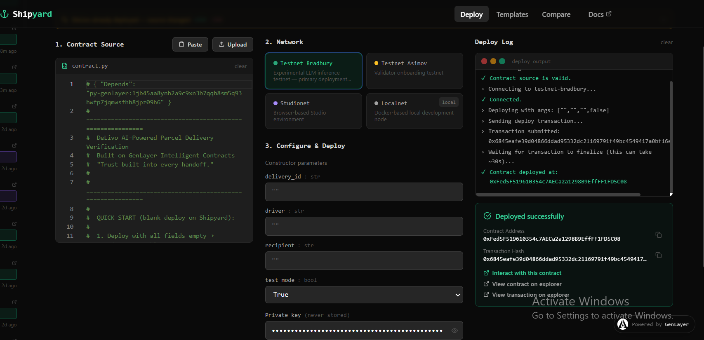
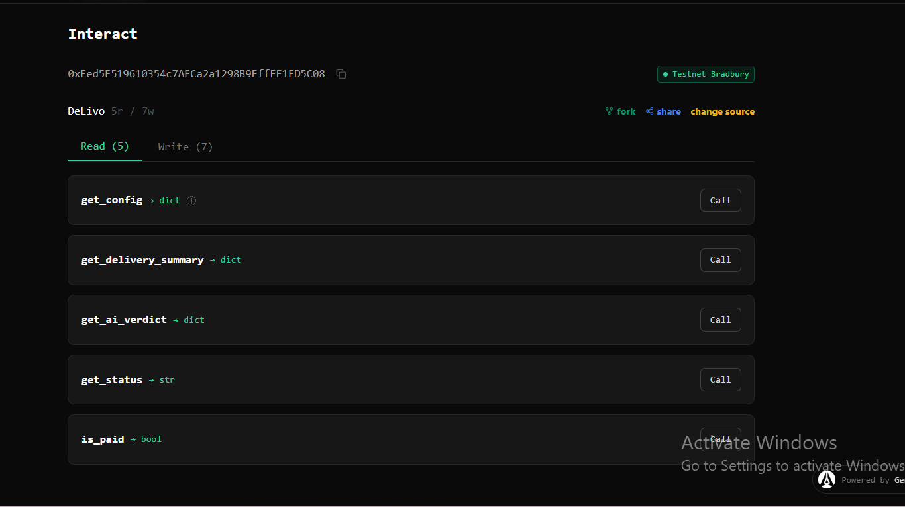
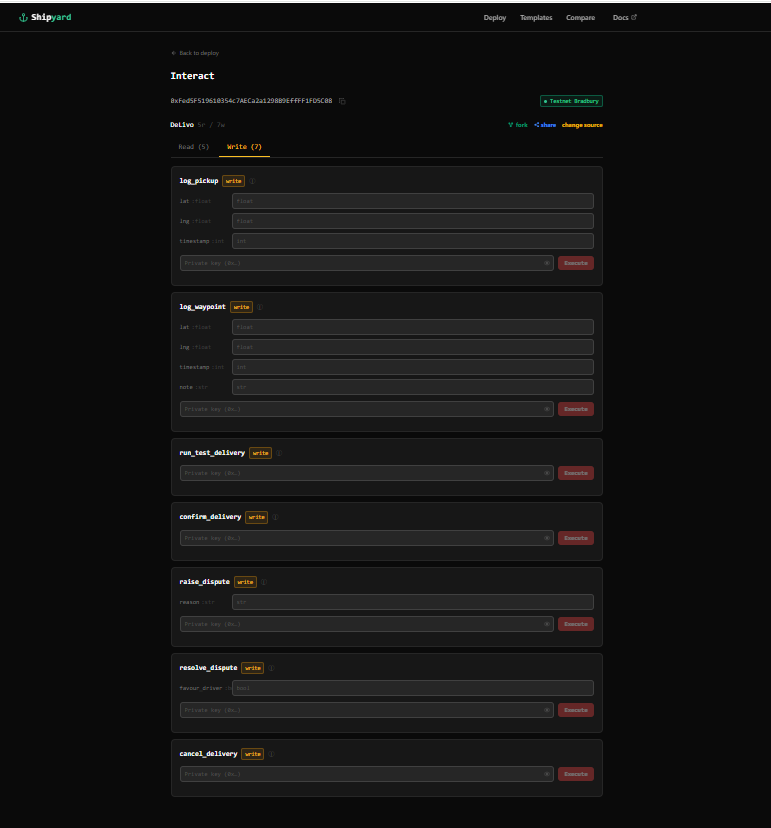
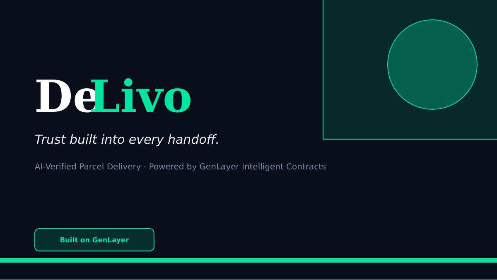
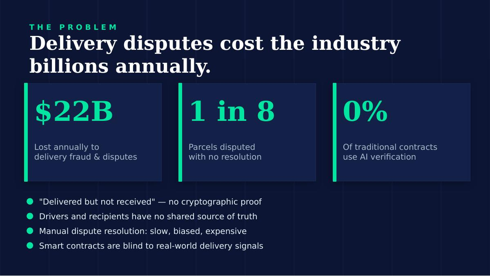
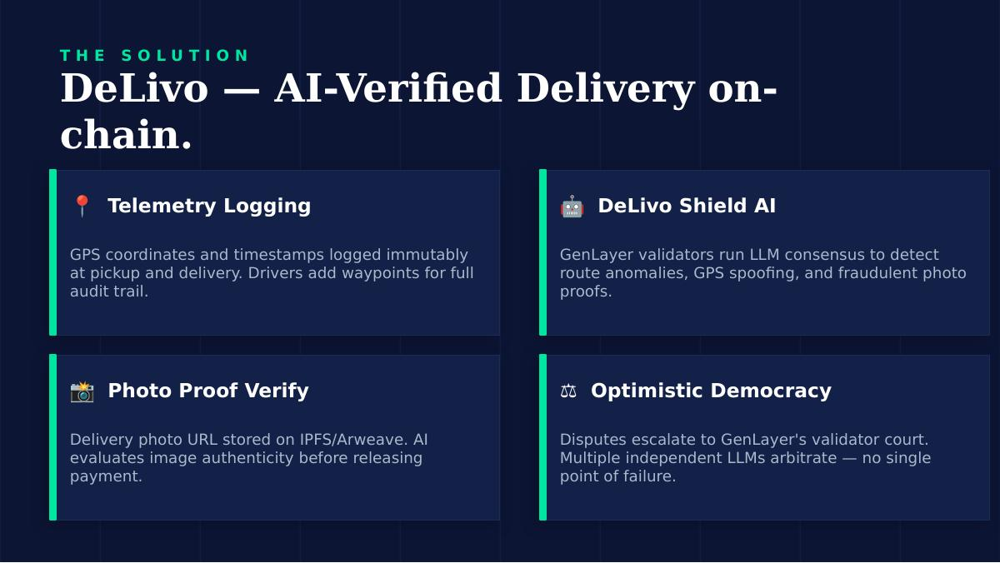
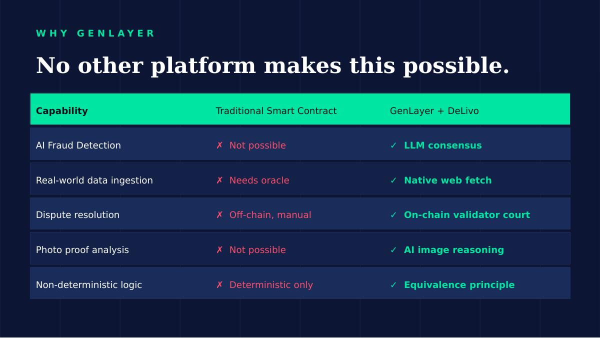

<div align="center">

# DeLivo

**Trust built into every handoff.**

AI-Verified Parcel Delivery · Built on GenLayer Intelligent Contracts

[](https://genlayer.com)
[](https://studio.genlayer.com)
[](https://docs.genlayer.com)
[](LICENSE)

</div>

---

## The Problem

Every day billions of parcels are shipped globally and a significant portion end in disputes. The most common complaint: **"delivered but not received."**

The root cause is simple: no one has proof. Delivery drivers have no cryptographic record. Recipients have no way to verify. And traditional smart contracts cannot help they are deterministic and blind to the real world. They cannot read GPS data, analyse photos, or reason about whether a route made sense.

The industry loses an estimated **$22 billion annually** to delivery fraud and disputes, resolved manually, slowly, and often unfairly.

---

## The Solution

DeLivo is an **Intelligent Contract** deployed on GenLayer that verifies every delivery before releasing payment.

When a driver marks a parcel as delivered, the contract does not just take their word for it. It:

1. Checks the GPS coordinates and timestamps for route consistency
2. Fetches the delivery photo proof and analyses it with AI
3. Runs fraud detection looking for GPS spoofing, impossible speeds, or suspicious stops
4. Only releases payment when multiple AI validators reach consensus that the delivery is legitimate

If anything looks wrong, payment stays locked in escrow. The recipient can confirm it themselves, or escalate to GenLayer's validator court for arbitration.

The result: no more "delivered but not received" disputes without on-chain proof.

---

## Why GenLayer

This contract could not exist on any other platform.

Traditional smart contracts are deterministic they can only execute simple logic against data already on-chain. They cannot call external URLs, fetch images, or reason about whether a delivery route was plausible.

GenLayer Intelligent Contracts are different. They run Python with access to LLMs and the live web. The key primitives DeLivo uses:

- `gl.get_webpage(url)` fetches the delivery photo directly from IPFS without an oracle
- `gl.exec_prompt(...)` runs fraud detection logic through an LLM
- `gl.eq_principle_prompt_non_comparative(...)` sends the same prompt to multiple independent validators and reaches consensus on the result

That last point is what makes DeLivo trustless. No single AI makes the call. Multiple validators independently assess the delivery evidence and must agree. This is GenLayer's **Optimistic Democracy** a decentralised AI court, not a single judge.

| What DeLivo needs | Traditional Contract | GenLayer |
|---|---|---|
| Analyse photo proof | Not possible | ✓ Native via `gl.get_webpage` |
| AI fraud detection | Not possible | ✓ LLM consensus |
| Route reasoning | Not possible | ✓ LLM spatial logic |
| Dispute arbitration | Off-chain, manual | ✓ On-chain validator court |
| Real-world data | Requires oracle | ✓ Built in |

---

## Deployed Contract

- **Network:** GenLayer Testnet Bradbury
- **Contract Address:** `0xFed5F519610354c7AECa2a1298B9EfFFF1FD5C08`
- **Transaction Hash:** `0x6845eafe39d04866ddad95332dc21169791f49bc4549417...`



---

## Contract Overview

The contract has **5 read methods** and **7 write methods**, all visible on the Shipyard Interact page.





### Roles

| Role | Who | What they can do |
|---|---|---|
| **Shipper** | Deployer | Funds escrow, cancels before pickup, resolves disputes |
| **Driver** | Set at deploy | Logs pickup, waypoints, and delivery |
| **Recipient** | Set at deploy | Confirms delivery or raises a dispute |

### Delivery lifecycle

```
pending → picked_up → in_transit → ai_reviewing
       → ai_approved  →  confirmed  →  (driver paid)
       → disputed     →  escalated  →  (paid or refunded)
```

---

## Testing the Contract

The deployed contract was deployed with `test_mode: True` and blank address fields. This means one wallet can act as all three roles no need for multiple wallets.

### Option A One-click test (recommended)

This runs a complete simulated Lagos to Ikeja delivery automatically, including pickup, waypoint, and AI verification. No fields to fill in except your private key.

**Step 1 Confirm test mode**

Read tab → `get_config` → Call

Expected response:
```json
{
  "test_mode": true,
  "tip": "test_mode ON call run_test_delivery() to test the full flow",
  "delivery_id": "DLVR-...",
  "driver": "0xYourAddress",
  "recipient": "0xYourAddress"
}
```

**Step 2 Run the test delivery**

Write tab → `run_test_delivery`

| Field | What to enter |
|---|---|
| Private key | Your testnet private key |

Click Execute. This runs the full flow pickup, waypoint, delivery, and AI fraud detection across GenLayer validators. Takes around 30 seconds.

**Step 3 See the AI verdict**

Read tab → `get_ai_verdict` → Call

Expected response:
```json
{
  "fraud_risk": "low",
  "route_ok": true,
  "photo_ok": true,
  "reasoning": "The route from Lagos Island to Ikeja GRA is geographically
                consistent. Transit time of 45 minutes is plausible for 
                Lagos traffic conditions..."
}
```

**Step 4 Confirm delivery**

Write tab → `confirm_delivery`

| Field | What to enter |
|---|---|
| Private key | Your testnet private key |

Click Execute. Payment is released to the driver.

**Step 5 Verify**

Read tab → `is_paid` → Call → should return `true`

---

### Option B Manual step by step

If you want to call each method yourself, use these exact values:

**`log_pickup`**

| Field | Value |
|---|---|
| lat | `6.4550` |
| lng | `3.3841` |
| timestamp | `1748000000` |

**`log_waypoint`** *(optional)*

| Field | Value |
|---|---|
| lat | `6.4698` |
| lng | `3.3887` |
| timestamp | `1748001200` |
| note | `checkpoint` |

**`log_delivery`** *(triggers AI verification)*

| Field | Value |
|---|---|
| lat | `6.6018` |
| lng | `3.3515` |
| timestamp | `1748002700` |
| photo_url | `https://upload.wikimedia.org/wikipedia/commons/thumb/4/47/PNG_transparency_demonstration_1.png/280px-PNG_transparency_demonstration_1.png` |

After `log_delivery` executes, call `get_ai_verdict` from the Read tab, then `confirm_delivery` to complete.

---

### Testing a dispute

After `run_test_delivery` completes, instead of confirming, call `raise_dispute`:

| Field | Value |
|---|---|
| reason | `Package was not received` |

Then resolve it with `resolve_dispute`:

| Field | Value |
|---|---|
| favour_driver | `True` to pay the driver, `False` to refund the shipper |

---

## Landing Page

A full frontend is not built yet. The designs below show the intended product direction. The file `delivo_landing.html` is included in the repo open it in any browser to see the interactive mockup with animations.









---

## Project Structure

```
delivo/
├── delivo_contract.py       # GenLayer Intelligent Contract deploy this
├── delivo_landing.html      # Landing page mockup (open in browser)
├── DeLivo_Pitch_Deck.pptx   # Pitch deck
├── screenshot-deploy.png    # Shipyard deploy screenshot
├── screenshot-read.png      # Contract read methods
├── screenshot-write.png     # Contract write methods
├── mockup-hero.jpg
├── mockup-problem.jpg
├── mockup-solution.jpg
├── mockup-compare.jpg
└── README.md
```

---

## Built With

- [GenLayer](https://genlayer.com) Intelligent Contract platform
- [Shipyard](https://app.genlayer.com) deployment and interaction UI
- [GenVM SDK](https://docs.genlayer.com) Python smart contract SDK

---

<div align="center">

*DeLivo Trust built into every handoff.*

</div>
